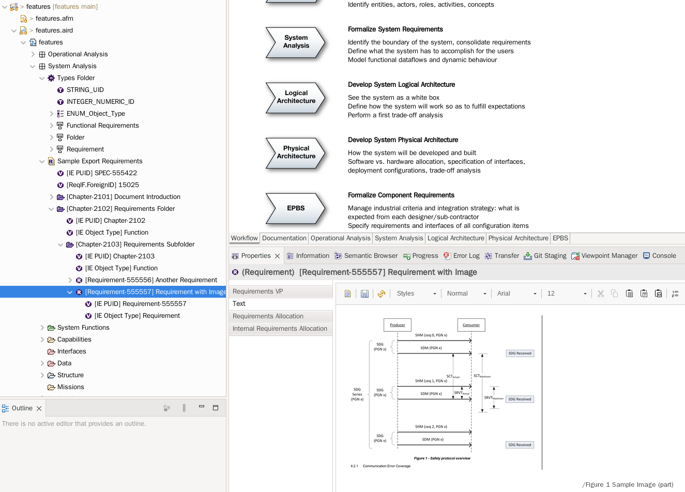

# JSON2ReqIF
Tool for conversion of arbitrary json into correct ReqIF file.

It was primarily developed to convert requirenents from the tools with broken or missing ReqIF support to Capella.



## Features
* uses JSONSchema for the schema definition
* uses jsonpath-ng for the data matching and processing
* supports DOORS/Capella mapping
* supports embedded images
* provides correct ReqIF passing validation
* operates as a commandline tool

## To be done
* support for the relations/links
* better jsonpath processing
* split commandline interface from library
* improve performance

## How to use

1. clone this repo
2. study samples folder
3. study supplied scripts
4. modify mapping

## Examples

### Command Line
```bash
python -m json2reqif sample/req_in.json output.reqif sample/mapping_capella.json
xmllint --schema xml_schema/dtc-11-04-05.xsd --noout output.reqif
```

### Library

#### Code
```python
from json2reqif import (
    loadMapping,
    convert
)

mapping = "sample/simple_mapping.json"
input = {
    "Caption": "Sample Export Requirements",
    "UID": "UNIQ-1",
    "Id": "1",
    "DocumentVersion": "0.1",
    "children": [
        {
            "SectionNumber": "1",
            "Caption": "Requirements Folder",
            "Content": "",
            "UID": "UNIQ-2",
            "Id": "2",
            "children": [
                {
                    "SectionNumber": "1.1",
                    "Caption": "First Requirement",
                    "Content": "<p>Test String</p>",
                    "UID": "UNIQ-3",
                    "Id": "3",
                    "children": []
                }
            ]
        }
    ]
}

config = loadMapping(mapping)
print(convert(input, config))
```
Note: empty children node on leaf is mandatory to distinct folders from leaves, due to https://github.com/h2non/jsonpath-ng/issues/49

#### Output
```xml
<?xml version="1.0" encoding="UTF-8"?>
<REQ-IF xmlns="http://www.omg.org/spec/ReqIF/20110401/reqif.xsd" xmlns:xhtml="http://www.w3.org/1999/xhtml">
  <THE-HEADER>
    <REQ-IF-HEADER IDENTIFIER="HDR_3GJQm7W9PV2JQacMR2qEYb">
      <CREATION-TIME>2025-12-11T16:22:53.000+00:00</CREATION-TIME>
      <REPOSITORY-ID>Random Repository Id</REPOSITORY-ID>
      <REQ-IF-TOOL-ID>JSON to ReqIF Converter</REQ-IF-TOOL-ID>
      <REQ-IF-VERSION>1.0</REQ-IF-VERSION>
      <SOURCE-TOOL-ID>Custom Tool 1.x.x</SOURCE-TOOL-ID>
      <TITLE>Exported Reqif</TITLE>
    </REQ-IF-HEADER>
  </THE-HEADER>
  <CORE-CONTENT>
    <REQ-IF-CONTENT>
      <DATATYPES>
        <DATATYPE-DEFINITION-STRING IDENTIFIER="DTD_9ysHzrRjVTmvwuWQxcJSR2" LAST-CHANGE="2025-12-11T16:22:53.000+00:00" LONG-NAME="STRING_UID" MAX-LENGTH="50"/>
        <DATATYPE-DEFINITION-XHTML IDENTIFIER="DTD_UJuWejAsHixfDR7QwNPrBt" LAST-CHANGE="2025-12-11T16:22:53.000+00:00" LONG-NAME="XHTML">
        </DATATYPE-DEFINITION-XHTML>
        <DATATYPE-DEFINITION-INTEGER IDENTIFIER="DTD_b6ErtEj4SYsqy3gMZY32Re" LAST-CHANGE="2025-12-11T16:22:53.000+00:00" LONG-NAME="INTEGER_NUMERIC_ID" MAX="999999" MIN="0"/>
        <DATATYPE-DEFINITION-ENUMERATION IDENTIFIER="DTD_N2cYnugkybmMwzwvoxyBt5" LAST-CHANGE="2025-12-11T16:22:53.000+00:00" LONG-NAME="ENUM_Object_Type">
          <SPECIFIED-VALUES>
            <ENUM-VALUE IDENTIFIER="EV_eMFNushLyQcpvQ2oCRLD3N" LAST-CHANGE="2025-12-11T16:22:53.000+00:00" LONG-NAME="Requirement">
              <PROPERTIES>
                <EMBEDDED-VALUE KEY="0" OTHER-CONTENT="Magenta"/>
              </PROPERTIES>
            </ENUM-VALUE>
          </SPECIFIED-VALUES>
        </DATATYPE-DEFINITION-ENUMERATION>
      </DATATYPES>
      <SPEC-TYPES>
        <SPECIFICATION-TYPE IDENTIFIER="ST_ZFnvfbE55WeAFgcjr8rkdW" LAST-CHANGE="2025-12-11T16:22:53.000+00:00" LONG-NAME="Functional Requirements">
          <SPEC-ATTRIBUTES>
            <ATTRIBUTE-DEFINITION-STRING IDENTIFIER="SAD_QteZtKegFBibh69Do33KNC" LAST-CHANGE="2025-12-11T16:22:53.000+00:00" LONG-NAME="IE PUID">
              <TYPE>
                <DATATYPE-DEFINITION-STRING-REF>DTD_9ysHzrRjVTmvwuWQxcJSR2</DATATYPE-DEFINITION-STRING-REF>
              </TYPE>
            </ATTRIBUTE-DEFINITION-STRING>
            <ATTRIBUTE-DEFINITION-XHTML IDENTIFIER="SAD_GyK96KkN2s9jZu5Qak8gDm" LAST-CHANGE="2025-12-11T16:22:53.000+00:00" LONG-NAME="ReqIF.Description">
              <TYPE>
                <DATATYPE-DEFINITION-XHTML-REF>DTD_UJuWejAsHixfDR7QwNPrBt</DATATYPE-DEFINITION-XHTML-REF>
              </TYPE>
            </ATTRIBUTE-DEFINITION-XHTML>
            <ATTRIBUTE-DEFINITION-INTEGER IDENTIFIER="SAD_YJ9Wnzf3aPFHVDyx4mQNUh" LAST-CHANGE="2025-12-11T16:22:53.000+00:00" LONG-NAME="ReqIF.ForeignID">
              <TYPE>
                <DATATYPE-DEFINITION-INTEGER-REF>DTD_b6ErtEj4SYsqy3gMZY32Re</DATATYPE-DEFINITION-INTEGER-REF>
              </TYPE>
            </ATTRIBUTE-DEFINITION-INTEGER>
            <ATTRIBUTE-DEFINITION-XHTML IDENTIFIER="SAD_hooYiNsyejAjLRmSEELHjM" LAST-CHANGE="2025-12-11T16:22:53.000+00:00" LONG-NAME="ReqIF.Name">
              <TYPE>
                <DATATYPE-DEFINITION-XHTML-REF>DTD_UJuWejAsHixfDR7QwNPrBt</DATATYPE-DEFINITION-XHTML-REF>
              </TYPE>
            </ATTRIBUTE-DEFINITION-XHTML>
          </SPEC-ATTRIBUTES>
        </SPECIFICATION-TYPE>
        <SPEC-OBJECT-TYPE IDENTIFIER="SOT_eMFNushLyQcpvQ2oCRLD3N" LAST-CHANGE="2025-12-11T16:22:53.000+00:00" LONG-NAME="Requirement">
          <SPEC-ATTRIBUTES>
            <ATTRIBUTE-DEFINITION-STRING IDENTIFIER="AD_fr7thQH2E8rRb8GFCudPxX" LAST-CHANGE="2025-12-11T16:22:53.000+00:00" LONG-NAME="IE PUID">
              <TYPE>
                <DATATYPE-DEFINITION-STRING-REF>DTD_9ysHzrRjVTmvwuWQxcJSR2</DATATYPE-DEFINITION-STRING-REF>
              </TYPE>
            </ATTRIBUTE-DEFINITION-STRING>
            <ATTRIBUTE-DEFINITION-ENUMERATION IDENTIFIER="AD_QV5KAfhPRAR25tmsTC6FPH" LAST-CHANGE="2025-12-11T16:22:53.000+00:00" LONG-NAME="IE Object Type" MULTI-VALUED="false">
              <TYPE>
                <DATATYPE-DEFINITION-ENUMERATION-REF>DTD_N2cYnugkybmMwzwvoxyBt5</DATATYPE-DEFINITION-ENUMERATION-REF>
              </TYPE>
            </ATTRIBUTE-DEFINITION-ENUMERATION>
            <ATTRIBUTE-DEFINITION-XHTML IDENTIFIER="AD_T2iDLXdKQkKEAfGYR8Vxu9" LAST-CHANGE="2025-12-11T16:22:53.000+00:00" LONG-NAME="ReqIF.Name">
              <TYPE>
                <DATATYPE-DEFINITION-XHTML-REF>DTD_UJuWejAsHixfDR7QwNPrBt</DATATYPE-DEFINITION-XHTML-REF>
              </TYPE>
            </ATTRIBUTE-DEFINITION-XHTML>
            <ATTRIBUTE-DEFINITION-XHTML IDENTIFIER="AD_PwaynrVzn7XQ2SgW4Foz32" LAST-CHANGE="2025-12-11T16:22:53.000+00:00" LONG-NAME="ReqIF.Text">
              <TYPE>
                <DATATYPE-DEFINITION-XHTML-REF>DTD_UJuWejAsHixfDR7QwNPrBt</DATATYPE-DEFINITION-XHTML-REF>
              </TYPE>
            </ATTRIBUTE-DEFINITION-XHTML>
          </SPEC-ATTRIBUTES>
        </SPEC-OBJECT-TYPE>
      </SPEC-TYPES>
      <SPEC-OBJECTS>
      </SPEC-OBJECTS>
      <SPECIFICATIONS>
        <SPECIFICATION IDENTIFIER="SPEC_EszrwnfwiofnDwqPaVgFbu" LAST-CHANGE="2025-12-11T16:22:53.000+00:00" LONG-NAME="Sample Export Requirements">
          <TYPE>
            <SPECIFICATION-TYPE-REF>ST_ZFnvfbE55WeAFgcjr8rkdW</SPECIFICATION-TYPE-REF>
          </TYPE>
          <CHILDREN>
          </CHILDREN>
          <VALUES>
            <ATTRIBUTE-VALUE-STRING THE-VALUE="UNIQ-1">
              <DEFINITION>
                <ATTRIBUTE-DEFINITION-STRING-REF>SAD_QteZtKegFBibh69Do33KNC</ATTRIBUTE-DEFINITION-STRING-REF>
              </DEFINITION>
            </ATTRIBUTE-VALUE-STRING>
            <ATTRIBUTE-VALUE-INTEGER THE-VALUE="1">
              <DEFINITION>
                <ATTRIBUTE-DEFINITION-INTEGER-REF>SAD_YJ9Wnzf3aPFHVDyx4mQNUh</ATTRIBUTE-DEFINITION-INTEGER-REF>
              </DEFINITION>
            </ATTRIBUTE-VALUE-INTEGER>
            <ATTRIBUTE-VALUE-XHTML>
              <DEFINITION>
                <ATTRIBUTE-DEFINITION-XHTML-REF>SAD_hooYiNsyejAjLRmSEELHjM</ATTRIBUTE-DEFINITION-XHTML-REF>
              </DEFINITION>
              <THE-VALUE><xhtml:div>Sample Export Requirements</xhtml:div></THE-VALUE>
            </ATTRIBUTE-VALUE-XHTML>
          </VALUES>
        </SPECIFICATION>
      </SPECIFICATIONS>
    </REQ-IF-CONTENT>
  </CORE-CONTENT>
</REQ-IF>
```

## License

`json2reqif` is distributed under the terms of the [EPL-2.0](https://www.eclipse.org/legal/epl-2.0/) license.
